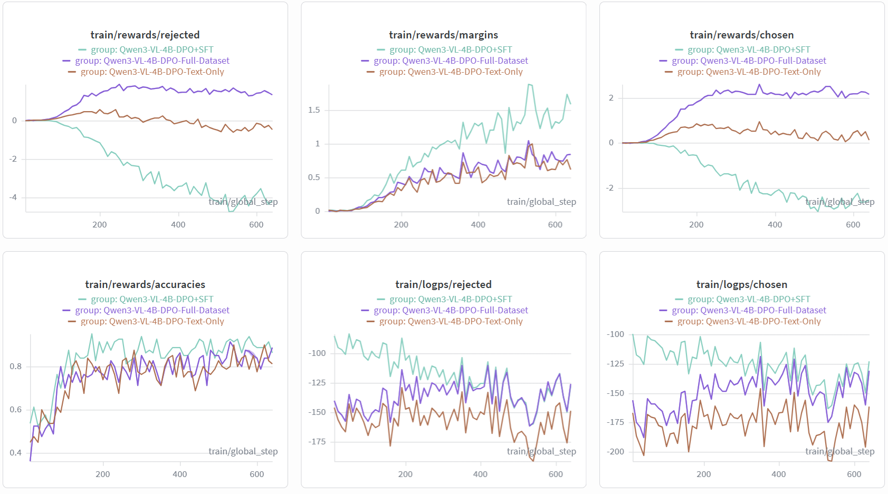
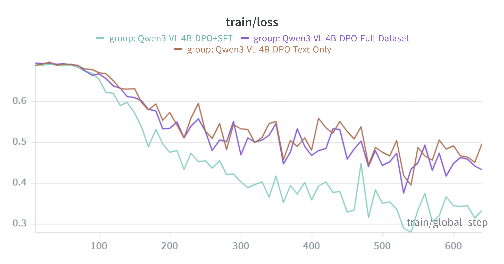

# Multimodal Hallucination Mitigation in Vision-Language Models via DPO
Official Implementation for my Final Year Project.

## Overview
Hallucination remains a critical challenge in vision-language models (VLMs), where generated responses contain content inconsistent with the provided image. While Direct Preference Optimization (DPO) has shown promise for hallucination mitigation in earlier VLM architectures, its effectiveness on more recent models remains underexplored. This project investigates DPO-based hallucination mitigation on Qwen3-VL-4B-Instruct, examining the effects of DPO through training configuration ablations, preference data modality, and evaluation methodology. 

## Research Objectives
- Quantify hallucination rates in baseline VLMs using established benchmarks (POPE, MMHal-Bench).
- Fine-tune a VLM using DPO on a hallucination mitigation dataset (RLHF-V) and evaluate hallucination reduction.
- Analyse effects of DPO training using reward and log-probabilities plots and trade-offs between hallucination mitigation and informativeness.

## Setup
### Prerequisites
- Python 3.11+
- CUDA 11.8+ (for GPU training)

### Installation
```bash
# Clone with submodules
git clone --recurse-submodules https://github.com/HilariusJeremy/fyp-multimodal-hallucination.git
cd fyp-multimodal-hallucination

# If you already cloned without --recurse-submodules, run:
# git submodule update --init --recursive

python -m venv venv
source venv/bin/activate       # Windows: venv\Scripts\activate

# Install LLaMA-Factory
pip install -e external/llama-factory[torch,metrics]

# Install lmms-eval
pip install -e external/lmms-eval
```

### Dataset
The preference data is loaded directly from HuggingFace: [openbmb/RLHF-V-Dataset](https://huggingface.co/datasets/openbmb/RLHF-V-Dataset). It contains 5,733 preference pairs (chosen/rejected responses) across image-text tasks drawn from COCO, VQAv2, ShareGPT4V, and other sources.

Download it once to data/raw/ using the HuggingFace CLI:
```bash
huggingface-cli download openbmb/RLHF-V-Dataset --repo-type dataset --local-dir data/raw
```

## Training
### SFT Training
Run the conversion script to produce LLaMA-Factory-compatible files in data/processed/:
```bash
python scripts/convert_rlhf_v_to_sft.py data/raw/train.parquet
```

Run training using LLaMA-Factory:
```bash
llamafactory-cli train configs/train/qwen3vl_lora_sft.yaml
```

Perform merging for inference:
```bash
llamafactory-cli export configs/merge/qwen3vl_lora_sft.yaml
```

### DPO Training
Before running, set model_name_or_path in configs/train/qwen3vl_lora_dpo.yaml to either the base model HuggingFace ID (Qwen/Qwen3-VL-4B-Instruct) or the path to the merged SFT checkpoint.

To run DPO training:
```bash
llamafactory-cli train configs/train/qwen3vl_lora_dpo.yaml
```

Perform merging for inference:
```bash
llamafactory-cli export configs/merge/qwen3vl_lora_dpo.yaml
```

### Text-Only DPO Training 
Run the conversion script to produce LLaMA-Factory-compatible files in data/processed/:
```bash
python scripts/convert_rlhf_v_to_dpo_text_only.py data/raw/train.parquet
```

Perform Text-Only DPO training:
```bash
llamafactory-cli train configs/train/qwen3vl_lora_dpo_text_only.yaml
```

Perform merging for inference:
```bash
llamafactory-cli export configs/merge/qwen3vl_lora_dpo_text_only.yaml
```

## Evaluation
### MMHal-Bench
**Step 1 - Download the dataset.** The MMHalBench evaluation benchmark is sourced from [Shengcao1006/MMHal-Bench](https://huggingface.co/datasets/Shengcao1006/MMHal-Bench/tree/main). Download it to data/raw/mmhalbench/:
```bash
huggingface-cli download Shengcao1006/MMHal-Bench --repo-type dataset --local-dir data/raw/mmhalbench
```

Unzip the test data after downloading:
```bash
unzip data/raw/mmhalbench/test_data.zip -d data/raw/mmhalbench/
```

**Step 2 - Run inference.** Generate model responses against the benchmark questions and place the output JSON in data/raw/mmhalbench/responses/:
```bash
python scripts/inference_mmhalbench.py \
    --model_path <path-to-checkpoint-or-hf-model-id> \
    --output data/raw/mmhalbench/responses/response_<model_name>.json \
    --max_new_tokens 512
```
Optionally pass `--adapter_path` to load a LoRA adapter on top of the base model without merging:
```bash
python scripts/inference_mmhalbench.py \
    --model_path <path-to-base-model> \
    --adapter_path <path-to-adapter> \
    --output data/raw/mmhalbench/responses/response_<model_name>.json \
    --max_new_tokens 512
```

**Step 3 -  Score responses using LLM as the judge.**
cd data/raw/mmhalbench
```bash
python eval_gpt4.py \
    --response responses/<response_name>.json \
    --api-key <your-openai-api-key> \
    --gpt-model gpt-4o \                  # or change as needed
    --evaluation results/<response_name>.json
```
Evaluation results are saved to results/logs/ for comparison across model variants. Sample responses from previous runs are available in results/responses/ and final MMHalBench evaluation scores are in results/evals/ for reference.
> Replicability note: MMHalBench scores are not guaranteed to be fully replicable. The GPT-4o judge is an external model with no random seed control, and scoring may vary slightly across API calls or model versions. Results should be treated as indicative rather than exact.

### POPE
```bash
cd external/lmms-eval
python -m lmms_eval \
  --model qwen2_5_vl \
  --model_args pretrained=<path-to-checkpoint>\
  --tasks pope_full \
  --batch_size 1 \
  --limit 8
  --output_path ../../results/logs/<model-name>/pope_results.json
```

## Key Results
| Model | POPE Adversarial F1 ↑ | MMHalBench Score ↑ | MMHalBench Hal Rate ↓ |
|-------|-----------|-------------------|----------------------|
| Qwen3-VL-4B-Instruct (baseline) | 0.8785 | 3.74 | 0.46 |
| + DPO | 0.8766 | 3.92 | 0.41 |
| + DPO (text-only) | 0.8765 | 3.81 | 0.46 |
| + SFT | 0.8749 | 3.66 | **0.32** |
| + SFT + DPO | 0.8731 | **4.43** | 0.34 |





